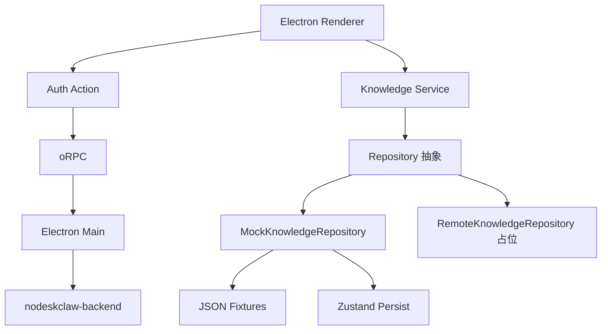

# Copilot Knowledge 桌面端 v0.1 完整改造

严格遵循 PRD `prd/v0.1.md`，按 P1→P6 分阶段落地，禁止一次性全仓重构。全程遵守三层分离（Main / Preload / Renderer），Feature 不直接 import JSON、不直接调 IPC Client，Mock 统一走 Repository。不改 `components/ui/`、`ipc/manager.ts`、`ipc/handler.ts`、`routeTree.gen.ts`。

## 现状确认（已核对）
- `src/ipc/router.ts` 仍注册 `webWorkspace`、`autotaskApi`。
- `src/main.ts` 存在 `nodeIntegration: true`、启动即 `await clearSession()`。
- `package.json` = `AutoTask-studio`/`SMC-Copilot`；`forge.config.ts` = `SMC-Copilot` / publisher `LuanRoger/electron-shadcn`。
- `AutoTaskAuthProvider` 用 `getApiMode()==="mock"` 注入 `MOCK_AUTH_STATE` 并跳过登录（PRD 明令禁止）。
- 侧边栏 `sidebar-data.ts`、mock/*.json、features/* 全为旧领域。

## P1 应用净化（Task 02/03/06）
- 删除旧 Feature：`src/features/{artifacts,components,dashboard,runs,srm-portals,tasks,web-workspace,workflows,settings}/**`。
- 删除旧路由：`src/routes/{artifacts,components,dashboard}.tsx`、`src/routes/{runs,srm-portals,tasks,web-workspace,workflows}/**`、`src/routes/settings.tsx`。
- 删除 Web Workspace：`src/actions/web-workspace.ts`、`src/ipc/web-workspace/**`、`src/components/layout/web-workspace-route-sync.tsx`、`src/hooks/use-web-tab-updates.ts`、`src/hooks/use-backend-status.ts`。
- 删除旧数据服务：`src/services/{autotask-api,remote-api,mock-api,dto-mappers,api-client}.ts`、`src/actions/autotask-api.ts`、`src/ipc/autotask-api/**`、`src/main/autotask-api/**`。
- 删除旧 Mock：`src/mock/*.json`（全部 15 个）。
- 删除旧 Store：`src/stores/{human-action-store,settings-store,task-store}.ts`。
- 删除旧类型：`src/types/{artifact,audit-log,automation-task,dashboard,human-action,human-checkpoint,rpa-component,settings,srm-portal,task-run,worker,workflow,web-tab,browser}.ts`。
- 删除旧业务组件：`src/components/business/*`（保留目录，清空 AutoTask 专用件：artifact-preview、backend-status-badges、human-checkpoint-panel、login-state-badge、portal-actions、run-log-panel、status-badge、step-timeline、workflow-step-card、worker-status-card、srm-portal-card、task-actions、priority-badge、progress-cell）。
- 更新 `src/ipc/router.ts` 移除 `webWorkspace`、`autotaskApi`，仅留 `theme/window/app/shell/auth`。
- 更新 `src/main.ts`、`src/preload.ts`、`src/constants/index.ts` 移除 `webWorkspaceManager`、`WEB_WORKSPACE_TAB_UPDATED` 等引用。
- 重建导航 `src/components/layout/data/sidebar-data.ts`：主导航=知识工作台/知识库/知识集/文档中心/上传任务/知识问答；`routeTitles`/`getPageTitle` 全量替换，兜底改 `Copilot Knowledge`。
- 更新 `src/components/layout/app-shell.tsx`、`global-search.tsx` 去除旧路由联动。
- 建立空白知识路由骨架（薄层）：`src/routes/{home,uploads,profile,preferences}.tsx` 与 `src/routes/{knowledge-bases,knowledge-sets,documents,chat}/**`，`src/routes/index.tsx` 重定向 `/home`。

验收：全仓不再出现 AutoTask / SRM / RPA / Worker / Artifact / Web Workspace / Copilot Studio / SMC-Copilot。

## P2 认证与用户中心 + Electron 安全（Task 04/05）
- `src/main.ts`：`nodeIntegration:false`、`nodeIntegrationInSubFrames:false`、`sandbox:true`、`contextIsolation:true`；删除启动处 `await clearSession()`；实现 PRD 10.4 启动流程（读 safeStorage → 未过期进入 / 即将过期自动刷新 / 刷新失败显示登录页）。
- 全仓删除 `debugger;` 与认证相关的 Token/密码/完整响应日志。
- 身份与业务数据模式拆分：删除 `VITE_AUTOTASK_API_MODE` 与 `getApiMode` 的登录耦合；`src/types/endpoint-config.ts`→`KnowledgeEndpointConfig`；新增 `src/services/endpoint-config.ts` 读取 `VITE_KNOWLEDGE_DATA_MODE`（`type KnowledgeDataMode = "mock" | "remote"`），auth 始终走真实后端。
- 认证模块重命名：`src/modules/auth/AutoTaskLoginScreen.tsx`→`KnowledgeLoginScreen.tsx`、`AutoTaskAuthProvider.tsx`→`KnowledgeAuthProvider.tsx`；移除 `MOCK_AUTH_STATE` 与 `isMockMode` 跳过登录逻辑（Mock 模式仍强制真实登录）；移除 `clearAllWebSessions` 调用；登录成功跳 `/home`。
- 登录页标题 `Copilot Studio`→`Copilot Knowledge`；`components/{LoginForm,EndpointConfigPanel,BootstrapScreen}` 文案清理。
- `/auth/me` 用户信息补全为 PRD 6.1 `PublicAuthUser`（id/displayName/email/phone/avatarUrl/currentOrgId/orgRole/portalOrgRole/isSuperAdmin），Token 仍仅存 Main。
- 用户菜单 `nav-user.tsx`：系统设置→用户中心、外观设置、退出登录。
- 产品标识：`package.json`（name `copilot-knowledge` / productName `Copilot Knowledge` / description）、`forge.config.ts`（executableName `Copilot-Knowledge`、setupExe `Copilot-Knowledge-Setup.exe`、publisher `loudon84/copilot-knowledge`）、`checkForUpdates` repo。

验收：`VITE_KNOWLEDGE_DATA_MODE=mock` 仍显示真实登录页；Renderer 无 Node Integration；重启不丢登录态。

## P3 知识领域数据层（Task 07/08）
- 领域类型 `src/types/`：`knowledge-base.ts`、`knowledge-set.ts`、`knowledge-document.ts`、`upload-job.ts`、`knowledge-chat.ts`、`permission.ts`（严格按 PRD 7.3–7.5 与 6.10 结构，含 `UserSummary`、`KnowledgeCitation`、`UploadStatus`）。
- Repository 抽象 `src/services/knowledge/`：`knowledge-repository.ts`（PRD 4.3 完整接口）、`mock-knowledge-repository.ts`（完整实现）、`remote-knowledge-repository.ts`（占位/未实现替换点）、`knowledge-service.ts`（按 `KnowledgeDataMode` 选择实现 + 统一模拟延迟 300ms 可配 0–2000ms）、`query-keys.ts`。
- Mock Fixture `src/mock/knowledge/`：dashboard/knowledge-bases/knowledge-sets/documents/document-versions/permissions/upload-jobs/chat-sessions/chat-messages/chat-answer-fixtures（数量按 PRD 7.2）。
- Persist Store `src/stores/`：`mock-knowledge-store.ts`、`upload-job-store.ts`、`chat-demo-store.ts`、`preference-store.ts`（Zustand persist → localStorage，提供"恢复默认 Demo 数据"重置）。
- Query Hooks：各 feature `api/` 下 TanStack Query hooks，仅经 `knowledge-service`。

## P4 知识管理页面（Task 09–12）
- 共享知识组件 `src/components/knowledge/`：knowledge-base-card、knowledge-set-card、document-status-badge、document-table、upload-status-badge、citation-card、permission-badge。
- `features/knowledge-home`（工作台，PRD 6.2）：统计卡 / 最近知识集 / 最近文档 / 解析状态 / 快捷入口。
- `features/knowledge-bases`（列表+详情，6.3/6.4）：卡片列表切换、搜索/状态/可见范围过滤、创建弹窗（含解析策略/Embedding 模型）、编辑、删除二次确认；详情四标签（文档/基本设置/成员与权限/运行信息，含 mock RAGFlow Dataset ID）。
- `features/knowledge-sets`（列表+详情，6.5/6.6）：CRUD、绑定知识库（搜索/多选/移除/排序/权重）、检索配置（TopK/阈值/权重/重排/回答模型）。
- `features/documents`（中心+详情，6.7/6.8）：全局过滤、上传、更新版本、重新解析、删除；详情五标签（预览占位/信息/版本记录/解析信息/访问权限）。
- `features/uploads`（6.9）：上传向导、每 500ms 进度、上传→解析→完成/失败、固定失败案例、重试/取消/清除、成功后新增 Mock 文档。
- 列表筛选保留到 URL Search Params（如 `/documents?knowledgeBaseId=kb_001&status=failed`）。

## P5 知识问答 Demo（Task 13）
- `features/knowledge-chat`（6.10）：三栏（会话列表/对话区/引用来源）；新建会话须选知识集 + 回答模式 + 是否显示引用；Mock 流式（检索→400ms→生成→逐字输出→2–4 条引用）；关键词命中 Fixture（销售/财务/采购/合同/产品/权限），未命中通用回答；点击引用打开文档详情；会话本地持久化。
- 路由 `src/routes/chat/index.tsx` 与 `chat/$sessionId.tsx`。

## P6 用户中心/偏好 + 测试与构建（Task 14–16）
- `features/profile`（6.11）：只显示真实 Auth 用户 + 登录服务地址 + 客户端版本；可编辑本地项（头像显示方式/语言/主题/默认知识集/是否显示引用面板）经 `preference-store`。
- `features/preferences`：本地外观设置（沿用 theme action）。
- Demo 规范（第 11 节）：统一延迟、Loading/Empty/Success/Error、写操作 Toast、删除二次确认。
- 单元测试（12.1）：MockRepository CRUD、知识集绑定、文档版本更新、上传状态机、Mock 问答引用、"Mock 模式不绕过登录"、"用户中心只显示 Auth 用户"。
- 组件测试（12.2）：创建弹窗/绑定选择器/文档过滤/上传进度/发消息/引用面板/用户菜单。
- E2E（12.3）：登录→工作台→建库→上传→解析完成→建知识集→绑定→新建会话→提问→查引用→用户中心→退出。
- 构建校验：`npm run check`、`npm run test`、`npm run test:e2e`、`npm run make`。

## 收尾
- 更新 `.cursor/CURSOR_CONTEXT.md` 与 `docs/`（若采用）业务模块表为知识领域。
- 每个 Task 完成后列出新增/修改/删除文件并运行 TS 检查与对应测试。

## 关键调用关系

